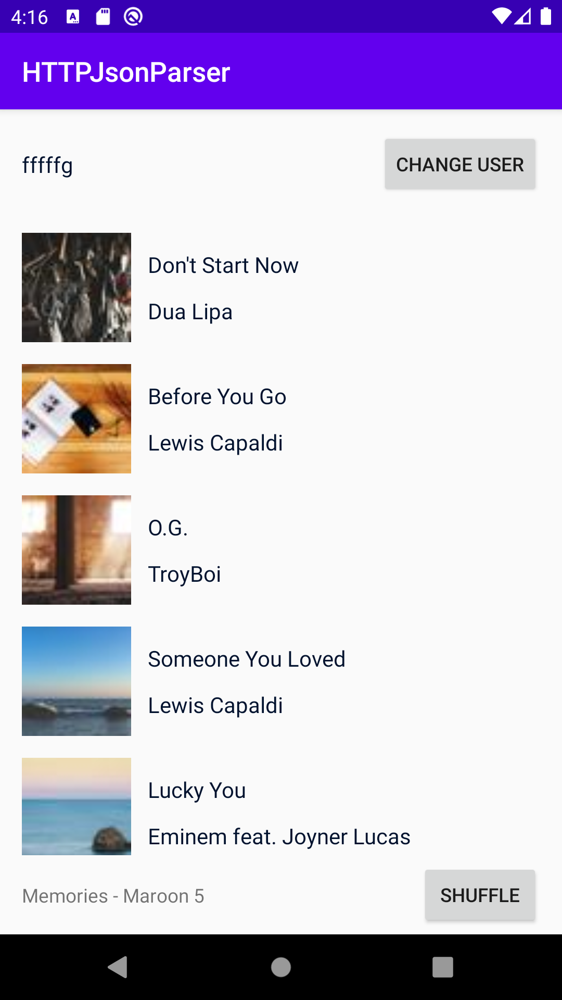
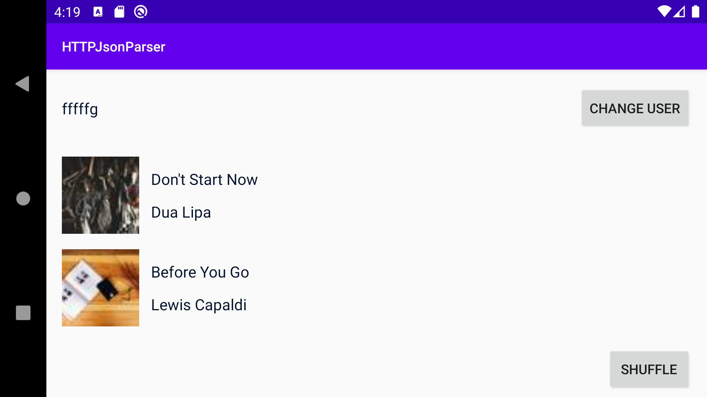

# Homework 4

Khoa Luong

This HTTPJSonParser app fetches a list of songs and shows its information in a recycler view. The user can change their name, which is persists with the app (rotating doesn't affect it). A spinner is also implemented for loading.

Music list view:

Username doesn't change with rotation:

Loading screen:

